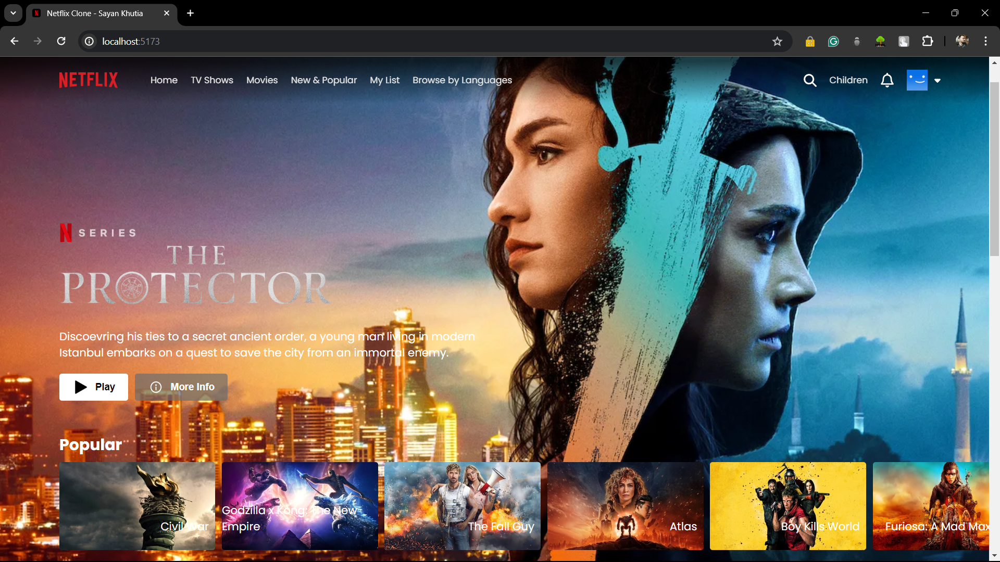
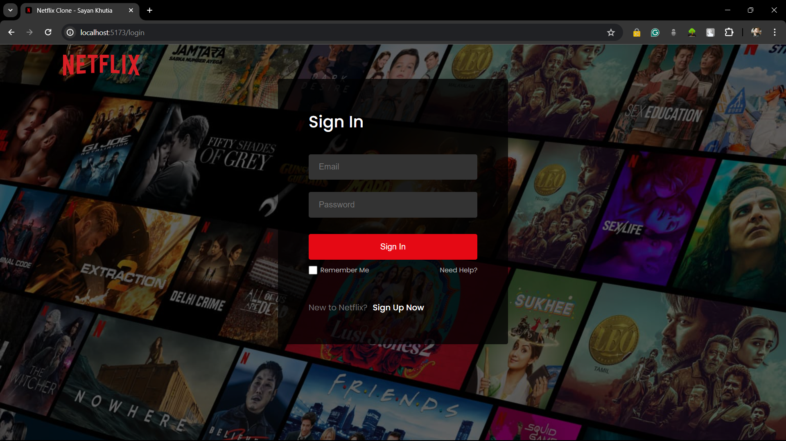
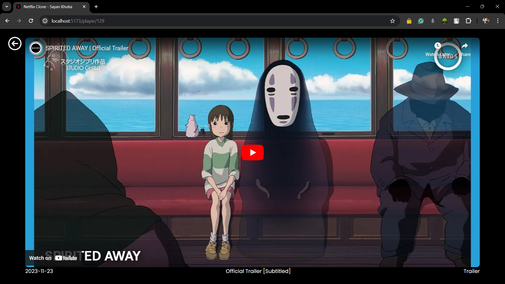

# Netflix Clone

A Netflix Clone website built using ReactJS and Firebase for user authentication. This project fetches movie and TV series details from the TMDB API and allows users to view trailers and other related information.

## Features

- User authentication with Firebase
- Fetch movie and TV series details from TMDB API
- Play trailers of movies and TV series
- Responsive design

## Technologies Used

- ReactJS
- Firebase Authentication
- TMDB API
- CSS

## Screenshots







## Getting Started

### Prerequisites

- Node.js
- npm (Node Package Manager)
- Firebase account
- TMDB API key

### Installation

1. Clone the repository
    ```bash
    git clone https://github.com/your-username/netflix-clone.git
    cd netflix-clone
    ```

2. Install dependencies
    ```bash
    npm install
    ```

3. Create a `.env` file in the root directory and add your Firebase and TMDB API credentials
    ```env
    REACT_APP_FIREBASE_API_KEY=your_firebase_api_key
    REACT_APP_FIREBASE_AUTH_DOMAIN=your_firebase_auth_domain
    REACT_APP_FIREBASE_PROJECT_ID=your_firebase_project_id
    REACT_APP_FIREBASE_STORAGE_BUCKET=your_firebase_storage_bucket
    REACT_APP_FIREBASE_MESSAGING_SENDER_ID=your_firebase_messaging_sender_id
    REACT_APP_FIREBASE_APP_ID=your_firebase_app_id
    REACT_APP_TMDB_API_KEY=your_tmdb_api_key
    ```

4. Start the development server
    ```bash
    npm start
    ```

5. Open [http://localhost:3000](http://localhost:3000) to view it in the browser.

## Contributing

Contributions are welcome! Please open an issue or submit a pull request for any improvements or bug fixes.

## License

This project is licensed under the MIT License - see the [LICENSE](LICENSE) file for details.

## Acknowledgements

- [TMDB API](https://www.themoviedb.org/documentation/api)
- [Firebase](https://firebase.google.com/)
- [ReactJS](https://reactjs.org/)